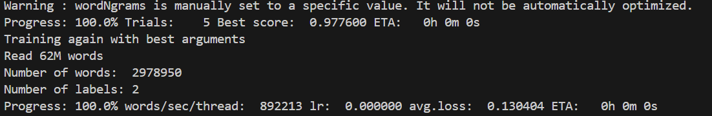
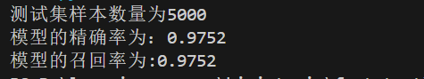

# 基于FastText的数学领域文本分类器

## 1. 项目概述

**目标：** 本项目旨在利用Facebook的FastText框架，训练一个高效的文本分类模型。该模型能够从海量的通用网页文本（Webtext）中，精准地筛选出与数学领域相关的文本内容。

## 2. 文件结构

```
      .
├── data/                      # 存放处理好的数据文件 (由data_download.py生成)
│   ├── train.txt
│   ├── valid.txt
│   └── test.txt
├── .venv/                     # Python虚拟环境
├── predict_fineweb.py         # 用于生成5000条打标数据的脚本
├── data_download.py           # 步骤一：数据下载、清洗与切分脚本
├── train_model.py             # 步骤二：模型训练与保存脚本
├── test_model.py              # 步骤三：模型加载与评估脚本
├── math_classifier.bin        # 最终产出的模型文件 (由train_model.py生成)
├── fineweb_5000_predictions.txt  # 分类结果
└── requirements.txt           # 项目依赖库
    
```

------


## 3. 使用方法

#### a. 环境准备

1. **克隆仓库**

   ```bash
   git clone <你的仓库链接>
   cd <仓库目录>
   ```

2. **创建并激活虚拟环境** (推荐)

   ```bash
   # Windows
   python -m venv .venv
   .\.venv\Scripts\activate
   
   # macOS / Linux
   python3 -m venv .venv
   source .venv/bin/activate
       
   ```

3. **安装依赖**

   ```bash
   pip install -r requirements.txt
   ```

#### b. 运行流程

按照以下顺序依次执行脚本，即可完成从数据准备到模型评估的全过程。

1. **执行数据准备脚本**

   ```bash
   python prepare_data.py
   ```

   > 此脚本会从Hugging Face流式下载正负样本，进行数据清洗，并按照80%训练、15%验证、5%测试的比例切分，生成data/目录下的三个.txt文件。

2. **执行模型训练脚本**

   ```bash
   python train_model.py
   ```

   > 此脚本会读取data/train.txt和data/valid.txt进行模型训练和自动调参，并将最优模型保存为math_classifier.bin。

3. **执行模型评估脚本**

   ```bash
   python test_model.py  
   ```

   > 此脚本会加载data/test.txt和训练好的模型math_classifier.bin，并返回测试结果，展示为精确率和召回率

------

4. **执行数据打标脚本**

   ```bash
   python predict_fineweb.py
   ```

   > 此脚本会从Hugging Face流式下载5000条数据，并使用训练好的模型math_classifier.bin进行分类预测，结果保存在fineweb_5000_predictions.txt中。


## 4. 实现过程

#### a. 资料检索

在项目初期，对FastText模型进行了调研。其核心优势在于训练速度极快，对硬件要求低，且在文本分类任务上通常能达到非常强大的基线水平，被誉为“文本分类的瑞士军刀”。其标准工作流包括：准备__label__<tag> <text>格式的数据、调用train_supervised函数进行训练、最后使用test函数进行评估。

#### b. 数据处理

- **数据源**: 正样本来源于open-web-math，负样本来源于fineweb。
- **核心挑战与解决方案**:
  1. **数据规模**: fineweb数据集规模达TB级别，无法完整下载。采用Hugging Face datasets库的streaming=True参数进行流式读取，解决了此问题。
  2. **数据污染**: 在初步实验中，发现模型评估结果异常（出现完美的1.0分数，后又出现读取行数与文件实际行数不符），经过深度调试，定位到问题根源在于数据流中混入了少量二进制数据（如图片文件头），这些数据在被强制解码为文本时，产生了Unicode控制字符（Control Characters）。这些不可见的字符会导致FastText底层的C++文件读取器提前中断。
  3. **数据清洗**: 为解决此问题，我们引入了regex库，并编写了clean_text函数。该函数利用正则表达式的Unicode属性匹配功能（\p{C}），**精确地移除了所有类别的控制字符**，同时保留了文本的有效内容。
- **数据切分**: 清洗后的数据，按照__label__<tag> <text>的格式，以**80% : 15% : 5%**的比例划分，分别存入train.txt, valid.txt, test.txt。

#### c. 模型训练

我们使用fasttext.train_supervised函数进行模型训练。关键参数设置如下，旨在平衡效率与性能：

```python
      model = fasttext.train_supervised(
    # 训练文件路径
    input=os.path.join(dir_name, train_text_name),
    # 启用2-gram字符级特征，增强对未登录词和特殊符号的建模能力
    wordNgrams=2,
    # 提供验证集路径，以F1分数为标准，进行自动超参数搜索
    autotuneValidationFile=os.path.join(dir_name, valid_text_name),
    # 自动调参过程的持续时间（秒）
    autotuneDuration=600
)
    
```

**训练过程日志:**

> 

#### d. 效果评估

使用model.test()函数在独立的测试集test.txt上对训练好的模型进行最终评估，以检验其在全新数据上的泛化能力。

**测试结果日志:**

> 

------


## 5. 最终结果

经过上述流程，我们成功训练出一个高性能的数学文本分类器。模型在包含5000个样本的留存测试集上表现出色，关键指标如下：

- **精确率 (Precision):** **0.9752**
- **召回率 (Recall):** **0.9752**
- **F1-Score:** **0.9752**

模型在验证集上的最佳分数（0.9776）与在测试集上的分数（0.9752）高度一致，证明模型泛化能力强，未出现过拟合。这表明该模型已能可靠地完成从大规模网页文本中筛选数学内容的核心任务。
